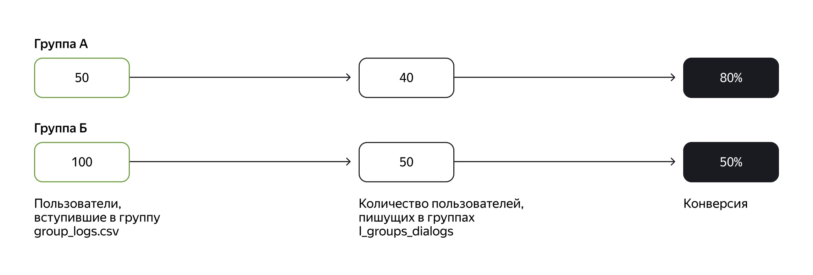
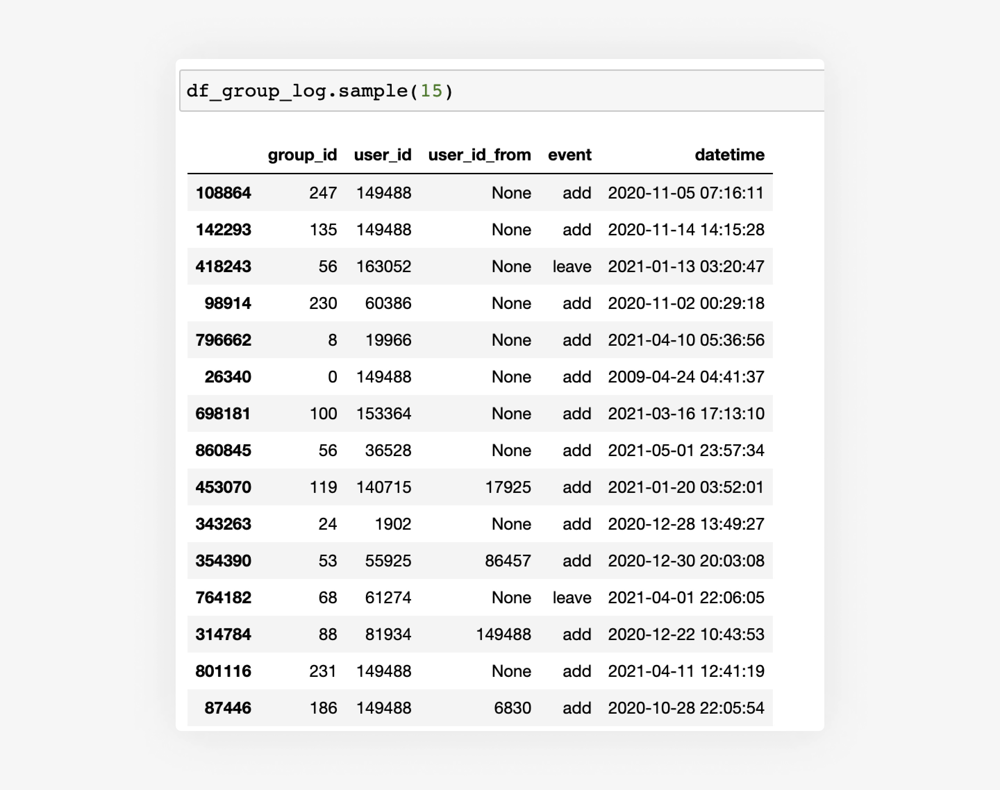

# Проектная работа по аналитическим базам данных #

Вы построили аналитическое хранилище и протестировали его в деле: выяснили возраст активной аудитории. Теперь вам предстоит пойти дальше — развить свою БД и ответить на следующий вопрос бизнеса. В рамках проекта вам нужно будет расширить модель данных, проанализировать новую информацию и помочь маркетологам дать эффективную рекламу соцсети в интернете.

# Описание задачи #

Чтобы привлечь новых пользователей, маркетологи хотят разместить на сторонних сайтах рекламу сообществ с высокой активностью. Вам нужно определить группы, в которых начала общаться большая часть их участников. В терминологии маркетинга их бы назвали пабликами с высокой конверсией в первое сообщение. На схеме ниже видно, что в группе А конверсия выше, чем в Б. Хотя в группе А сейчас общается только 40 пользователей соцсети, а в Б — 50, доля активных в А выше, ведь в ней всего 50 человек. В то время как в группе Б сообщения написали уже 50 участников, но это лишь половина от общего количества — 100. Значит, если в обе группы вступит одинаковое число людей, эффективнее сработает сообщество А, потому что оно лучше вовлекает своих участников. Получается, что для рекламы соцсети стоит выбрать группу А и другие паблики с высокой конверсией. Ваша задача — выявить и перечислить маркетологам такие сообщества.

Необходимо:

1) Перенести из S3 в staging-слой новые данные о входе и выходе пользователей из групп — файл group_log.csv.
Лог работы групп group_log.csv содержит:

 - group_id — уникальный идентификатор группы;
 - user_id — уникальный идентификатор пользователя;
 - user_id_from — поле для отметки о том, что пользователь не сам вступил в группу, а его добавил другой участник. Если пользователя пригласил в группу кто-то другой, поле будет непустым.
 - event — действие, которое совершено пользователем user_id. Возможны следующие варианты: 
create — пользователь создал группу;
add — пользователь user_id вступил сам или был добавлен в группу;
leave — пользователь user_id покинул группу.
 - datetime — время совершения event.

2) Создать в слое постоянного хранения таблицы для новых данных. Например, по схеме:

3) Перенести новые данные из staging-области в слой DDS.

4) Рассчитать конверсионные показатели для десяти самых старых групп:
 
 - количество пользователей, вступивших в группу, — cnt_added_users;
 - количество участников группы, которые написали хотя бы одно сообщение, — cnt_users_in_group_with_messages;
 - конверсию в первое сообщение из вступления в группу — group_conversion.

# Инструкция по выполнению проекта #
Шаг 1. Загрузить данные из S3.

Напишите DAG в Airflow, чтобы подключиться к бакету sprint6 в S3 и выгрузить файл group_log.csv в папку data.

Шаг 2. Создать таблицу group_log в Vertica. 

Заведите таблицу group_log в схеме *_STAGING с учётом формата данных в скачанном файле.

Шаг 3. Загрузить данные в Vertica. 

Реализуйте DAG, который будет считывать из папки data файл group_log.csv и загружать его в созданную таблицу group_log в схеме *__STAGING.

Шаг 4. Создать таблицу связи.

Добавьте в схему *__DWH таблицу связи l_user_group_activity с такими полями:

 - hk_l_user_group_activity — основной ключ типа INT;
 - hk_user_id — внешний ключ типа INT, который связан с основным ключом хаба MY__DWH.h_users;
 - hk_group_id — внешний ключ типа INT, который связан с основным ключом хаба MY__DWH.h_groups;
 - load_dt — временная отметка типа DATETIME о том, когда были загружены данные;
 - load_src — данные об источнике типа VARCHAR(20).

Шаг 5. Создать скрипты миграции в таблицу связи.

Напишите SQL-скрипт миграции данных из *__STAGING.group_log в линк l_user_group_activity.

Вставьте в таблицу l_user_group_activity данные с помощью INSERT и запроса из таблиц *__STAGING.group_log . Вам потребуется сделать JOIN хэш-ключей из таблицы хабов пользователей *__DWH.h_users и таблицы групп *__DWH.h_groups.

Заготовка кода:

    INSERT INTO MY__DWH.l_user_group_activity(hk_l_user_group_activity, hk_user_id,hk_group_id,load_dt,load_src)
    
    select distinct
    ***Ваш код здесь***
    
    from MY__STAGING.group_log as gl
    left join MY__DWH.h_users ***Ваш код здесь***
    left join MY__DWH.h_groups ***Ваш код здесь***
    ; 

Шаг 6. Создать и наполнить сателлит.

Добавьте в схему *__DWH сателлит s_auth_history и наполните его данными из *__STAGING.group_log и необходимых таблиц в хранилище через скрипт миграции.

Таблицу-сателлит создайте с набором полей:

 - hk_l_user_group_activity — внешний ключ к ранее созданной таблице связей типа INT. Напомним, в сателлитах нет первичных ключей.
 - user_id_from — идентификатор того пользователя, который добавил в группу другого. Если новый участник вступил в сообщество сам, это поле пустое. Задайте атрибуту user_id_from тип INT и наполните его из исходных загруженных данных *__STAGING.group_log.
 - event — событие пользователя в группе;
 - event_dt — дата и время, когда совершилось событие;
 - load_dt и load_src — знакомые вам технические поля.

Для наполнения сателлита используйте основной источник загруженных данных *__STAGING.group_log в связке с необходимыми таблицами:

 - MY__DWH.h_groups — для связи по хеш-ключу группы данных из MY__DWH.l_user_group_activity;
 - MY__DWH.h_users — для связи по хэш-ключу пользователя данных из MY__DWH.l_user_group_activity.

Заготовка кода вставки данных:

    INSERT INTO MY__DWH.s_auth_history(hk_l_user_group_activity, user_id_from,event,event_dt,load_dt,load_src)
    
    select ***Ваш Код здесь***
    
    from MY__STAGING.group_log as gl
    left join MY__DWH.h_groups as hg on gl.group_id = hg.group_id
    left join MY__DWH.h_users as hu on gl.user_id = hu.user_id
    left join MY__DWH.l_user_group_activity as luga on hg.hk_group_id = luga.hk_group_id and hu.hk_user_id = luga.hk_user_id
    ; 

Шаги 7. Подготовить CTE для ответов бизнесу.

Вы мигрировали данные и разложили их в реализованной модели данных для оптимального хранения. Теперь вам нужно реализовать две временные таблицы (Common Table Expression — CTE) для оптимального обращения к данным. К ним вы обратитесь, чтобы получить нужные ответы о доле пользователей, которые пишут в группах, относительно пользователей, которые просто вступили в группу.

Шаг 7.1. Подготовить CTE user_group_messages.

Начните с таблицы, которая поможет с анализом доли пользователей, которые активны в группах (user_group_messages) — пишут туда что-то.

1) Напишите SQL-запрос, который создаст CTE user_group_messages, а внутри:

 - реализуйте вложенный запрос, который будет возвращать хэш-ключ каждой группы hk_group_id и количество пользователей в группе, которые написали хотя бы раз — cnt_users_in_group_with_messages
 - не забудьте, что нужно учитывать только уникальных пользователей

2) Запустите запрос к данным из user_group_messages для подтверждения корректности рассчётов.

Заготовка кода:

    with user_group_messages as (
    select 
    ***Ваш Код здесь***
    )
    
    select hk_group_id,
    cnt_users_in_group_with_messages
    from user_group_messages
    order by cnt_users_in_group_with_messages
    limit 10
    ; 

Шаг 7.2. Подготовить CTE user_group_log.

Создайте временную таблицу, из которой сможете получать количество пользователей, вступивших в группы.

1) Напишите SQL-запрос, который создаст CTE user_group_log, а внутри: 

 - реализуйте вложенный запрос, который вернёт хэш-ключ каждой группы hk_group_id и количество пользователей в группе, которые в неё просто вступили cnt_added_users
 - не забудьте учесть только уникальных пользоватей
 - возьмите только 10 самых ранних созданных групп (таблица MY__DWH.h_groups, самые ранние группы по значению в поле registration_dt)
 - для получения всех событий добавления в группу event = 'add’ удобно использовать таблицу MY__DWH.s_auth_history

2) Запустите запрос к данным из user_group_log для подтверждения корректности рассчётов.

Заготовка кода:

    with user_group_log as (
    select ***Ваш Код здесь***
    )
    
    select hk_group_id
    ,cnt_added_users
    from user_group_messages
    order by cnt_added_users
    limit 10
    ; 

Шаг 7.3. Написать запрос и ответить на вопрос бизнеса.

Временные таблицы вы написали, теперь можно обратиться к ним, чтобы вывести нужные бизнесу ответы.

1) Напишите SQL-запрос, который выведет по десяти самым старым группам: 

 - Хэш-ключ группы hk_group_id
 - Количество новых пользователей группы (event = add). Назовите поле cnt_added_users
 - Количество пользователей группы, которые написали хотя бы одно сообщение. Назовите поле cnt_users_in_group_with_messages
 - Долю пользователей группы, которые начали общаться. Назовите выводимое поле group_conversion

2) Отсортируйте результаты по убыванию значений поля group_conversion.
